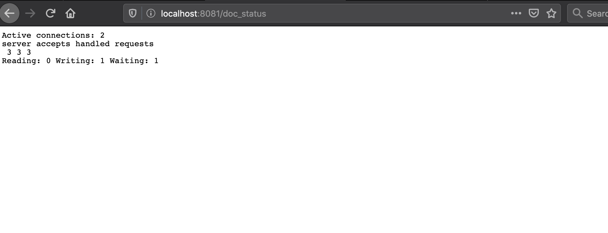

# Docker Compose

This is the complete demo built using docker-compose. You will need to add your trial certificate and key to the **builder** directory.

## Create Docker Network (Optional)
Build a docker network <br/>
``docker network create --driver=bridge --gateway=172.10.1.1 --subnet=172.10.1.0/24 docnet``

Creating a network with Compose is optional as docker compose will form a 'DNS' like service. In this example, you can address the service by it's name:
 - proxy
 - web1, web2, web3

How do I see my containers IP Address?

`docker inspect -f '{{range .NetworkSettings.Networks}}{{.IPAddress}}{{end}}' container_name_or_id`

## docker-compose.yml

In this file we again define each service, ports, volumes and custom network. If you notice the proxy service we don't use the default image, we build a customer docker image. `context` points use to the path of our dockerfile and `dockerfile` is our file name, in this case *Dockerfile*.

```
services:
  proxy:
    container_name: nginx_lb
    build:
      context: ./builder
      dockerfile: Dockerfile
    volumes:
      - ./lb_php/:/etc/nginx/conf.d/
    ports: 
      - "8081:80"
    networks:
      docnet:
        ipv4_address: 172.10.1.20
```

# NGINX OSS Health



# NGINX Plus: Access the api

`localhost:8081/api/6/`

View health:

`http://localhost:8081/api/6/http/upstreams/members/`

Here we see **web3** a state of unhealthy. If you navigate to the main branch and update the file `maint.html` in **php3** **FROM**:
```
<body>
MAINT MODE
</body>
```
**TO**
```
<body>
PROD MODE
</body>
```

# Prometheus

